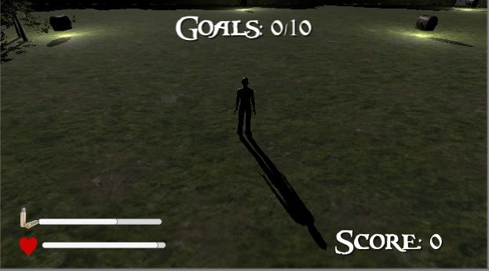
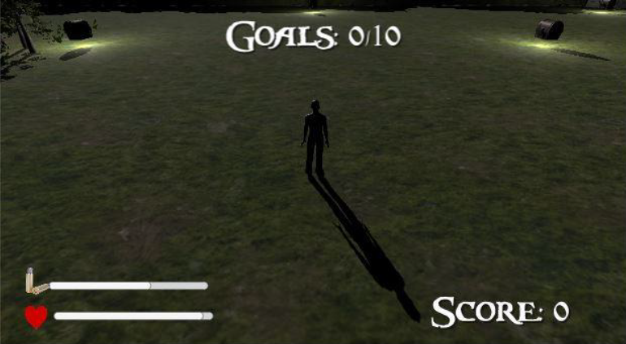
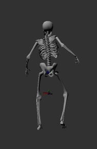
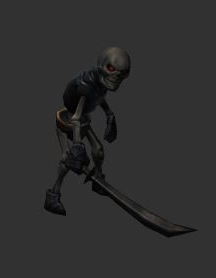
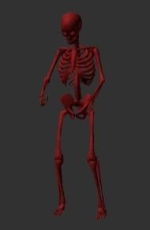
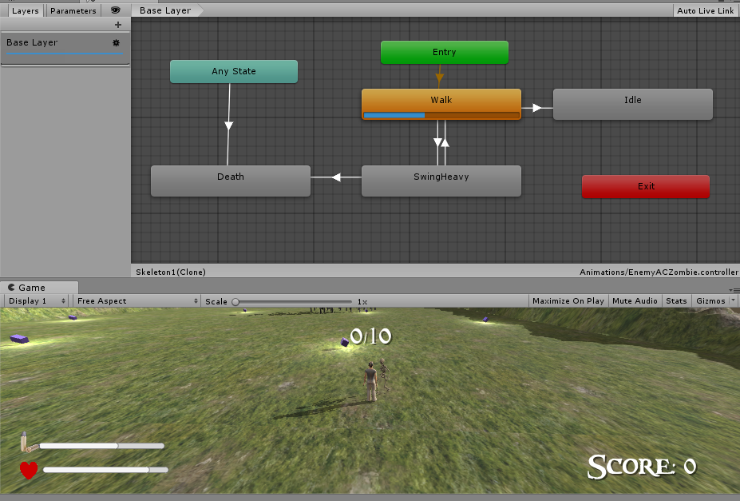
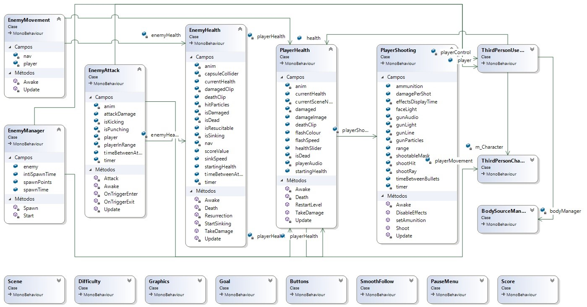
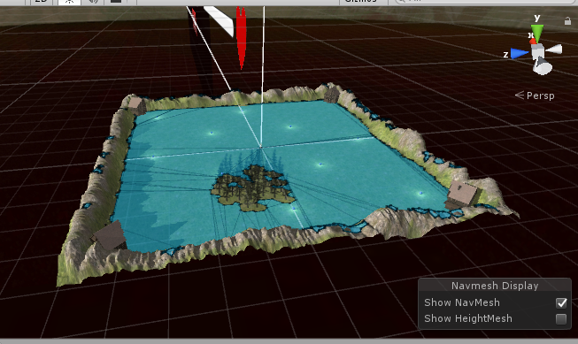

<h1 align="center">
  <p>Skull Survival 💀</p>
    
</h1>

---

<br>

<h1>
  
</h1>

---
## 🧾 About
**Skull Survival** is a game where I learned a lot. This project was a part of a final class project in which I used Microsoft Kinect and how to integrate it into a game environment. Also, I have created all Brief Game outline, the Software Engineer process, and the AI behind the game players.

---
## 📷 Screenshots
**Game beginning**
<h1 align="center">
  
</h1>

**Enemies**
<h1 align="center">
  
  
  
</h1>

**Enemy finite-state machine (FSM)**
<h1 align="center">
  
</h1>

**Class diagram**
<h1>
  
</h1>

**Terrain Nav Mesh**
<h1 align="center">
  
</h1>

---
## 🕖 Versioning
- Skull Survival v2.0 (relased in 13/07/2018)
- Skull Survival v1.5 (relased in 07/04/2018)
- Skull Survival v1.0 (relased in 29/06/2017)

---
## ✅ Main features
**Player**
- [x] Start game
- [x] Walk (L,R)
- [x] Jump
- [x] Shoot enemy

**Enemy**
- [x] Walk
- [x] Kill player
- [x] Die

---
## 🔧 Technology

- [C#](https://www.w3schools.com/cs/index.php) 
- [Unity](https://unity.com/) 💚
- [Microsoft Kinect](http://www.kinect.com/)

---
## 👨‍💻 How to Setup

```bash
  # Clone the project
  $ git clone https://github.com/abelgonzalez/Skull-Survival.git
```
```bash
  # Enter directory
  $ cd Skull-Survival
```

---
## 😎 How to Play

**Using Unity**
Download and install:

 - [Unity 2018.1.0f2 Personal (64 bits)](https://unity3d.com/pt/unity/whats-new/unity-2018.1.0)

 - [Kinect for Windows Software Development Kit (SDK) 2.0](https://www.microsoft.com/en-us/download/details.aspx?id=44561)

- Open Unity and load the project from **Codigo Fonte** folder.

**Play game from exe**
* With Kinect:
  - Download and install [Kinect for Windows Software Development Kit (SDK) 2.0](https://www.microsoft.com/en-us/download/details.aspx?id=44561)

  - Open **Build** folder and execute "Skull Survival.exe"

* Without Kinect: 
  - Open **Build** folder and execute "Skull Survival.exe"

---
## 👉 Additional information
* Demo using Kinect https://youtu.be/oy5ZzX8Q-h4
* Demo without Kinect https://youtu.be/g1KMN11Wa1o
* Brief Game outline and User Manual is available in [Doc](https://github.com/abelgonzalez/Skull-Survival/tree/main/doc) folder (in Portuguese).
* In case of sensitive bugs like security vulnerabilities, don't hesitate to contact me at abelgodev@gmail.com instead of using the issue tracker. I value your effort to improve the security and privacy of this project!

---
## 📝 License

This project is under the MIT license. See the file <a href="https://github.com/abelgonzalez/Skull-Survival/LICENSE">LICENCE</a> for more details.

---
## 🧑‍💻 Autor
<p align="center">Done with 💙 by Abel González Mondéjar</p>


[](https://www.linkedin.com/in/abelgonzalezmondejar/)
