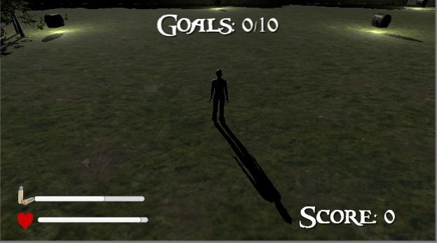

<h1 align="center">
  
  <p>Skull Survival 💀</p>
</h1>

<p align="center">
 <a href="#about">About</a> •
 <a href="#main-features">Main features</a> •
 <a href="#technologies">Technologies</a> •
 <a href="#how-to-setup"> How to Setup</a> •
 <a href="#how-to-play">How to Play</a> •
 <a href="#demo">Demo</a> •
 <a href="#license">License</a> •
 <a href="#author">Author</a>
</p>

---

<br>

<h1>
  
</h1>


### About

**Skull Survival** is a game where I learned a lot. This project was a part of a final class project in which I used Microsoft Kinect and how to integrate it into a game environment. Also, I have created all Brief Game outline, the Software Engineer process, and the AI behind the game players.

### 🧾 Main features
**Player**
- [x] Start game
- [x] Walk (L,R)
- [x] Jump
- [x] Shoot enemy

**Enemy**
- [x] Walk
- [x] Kill player
- [x] Die

### 🔧 Technologies

- [C#](https://www.w3schools.com/cs/index.php) 
- [Unity](https://unity.com/) 💚
- [Microsoft Kinect](http://www.kinect.com/)

### 👨‍💻 How to Setup

```bash
  # Clone the project
  $ git clone https://github.com/abelgonzalez/Skull-Survival.git
```
```bash
  # Enter directory
  $ cd Skull-Survival
```

### 😎 How to Play

**Using Unity**
* Pre-requisites:
1- Download and install:
- [Unity 2018.1.0f2 Personal (64 bits)](https://unity3d.com/pt/unity/whats-new/unity-2018.1.0)
- [Kinect for Windows Software Development Kit (SDK) 2.0](https://www.microsoft.com/en-us/download/details.aspx?id=44561)

2- Open the project with Unity and load it from folder **Codigo Fonte**

**Just play it**
* - With Kinect:
1- Download and install [Kinect for Windows Software Development Kit (SDK) 2.0](https://www.microsoft.com/en-us/download/details.aspx?id=44561)

2- Open **Build** folder and execute "Skull Survival.exe"

* - Without Kinect: 
1- Open **Build** folder and execute "Skull Survival.exe"

### 👉 Demo
* Demo with Kinect https://youtu.be/oy5ZzX8Q-h4
* Demo without Kinect https://youtu.be/g1KMN11Wa1o


### 📝 License

This project is under the MIT license. See the file <a href="https://github.com/abelgonzalez/Skull-Survival/LICENSE">LICENCE</a> for more details.

---
### 🧑‍💻 Autor
<p align="center">Done with 💙 by Abel González Mondéjar</p>


[](https://www.linkedin.com/in/abelgonzalezmondejar/)
